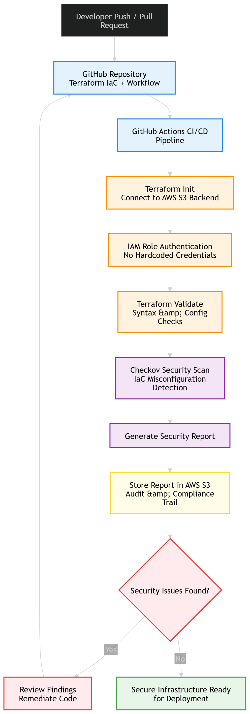

# Secure DevSecOps Pipeline with Terraform, AWS, and CI/CD Security Controls

## Overview

This project demonstrates the design and implementation of a secure DevSecOps pipeline that integrates infrastructure-as-code (IaC), cloud security, and automated compliance checks into a CI/CD workflow.

The pipeline is built using Terraform, AWS, GitHub Actions, and Checkov, with a focus on:

- Shift-left security
- Eliminating hardcoded credentials
- Automated security validation
- Audit-ready reporting for compliance

## Objectives

- Build a secure CI/CD pipeline for infrastructure deployment
- Integrate security scanning into the development lifecycle
- Enforce policy-as-code using Checkov
- Store audit logs for compliance and traceability
- Implement IAM-based authentication instead of static credentials

## Architecture Diagram



*Figure: Secure DevSecOps pipeline integrating CI/CD, Terraform, AWS, and security scanning.*

## Pipeline Workflow

1. Code commit or pull request triggers the pipeline
2. GitHub Actions initiates the CI/CD workflow
3. Terraform initializes using AWS S3 backend for remote state
4. IAM role-based authentication is used with no hardcoded credentials
5. Terraform validates configuration and syntax
6. Checkov scans infrastructure code for security misconfigurations
7. A security report is generated regardless of scan outcome
8. Reports are stored in AWS S3 for audit and compliance tracking
9. If issues are found, remediation is required before re-running the pipeline
10. If no issues are found, infrastructure is considered deployment-ready

## Security Features

- Infrastructure-as-Code security scanning using Checkov
- IAM role-based authentication to eliminate embedded credentials
- Shift-left security integrated into the CI/CD pipeline
- Automated detection of misconfigurations and policy violations
- Secure remote state management using AWS S3

## Compliance and Audit Capabilities

- Centralized storage of security reports in AWS S3
- Persistent audit trail of pipeline executions
- Traceability of infrastructure changes
- Alignment with industry frameworks such as:
  - NIST
  - CIS Benchmarks
  - SOC 2 (conceptual alignment)

## Technology Stack

| Category | Tools Used |
|----------|------------|
| CI/CD | GitHub Actions |
| Infrastructure | Terraform |
| Cloud | AWS (S3, IAM) |
| Security | Checkov |
| Version Control | GitHub |

## Key Highlights

- Designed a security-first CI/CD pipeline
- Integrated policy-as-code validation before deployment
- Implemented automated audit logging
- Demonstrated real-world DevSecOps practices

## Project Structure

```text
terraform-aws-devsecops-pipeline/
│
├── .github/workflows/
│   └── terraform-ci.yml
│
├── terraform/
│   ├── main.tf
│   ├── backend.tf
│   ├── backend-bootstrap.tf
│   ├── outputs.tf
│
├── security-reports/
│
├── assets/
│   └── devsecops-architecture.png
│
├── .gitignore
└── README.md